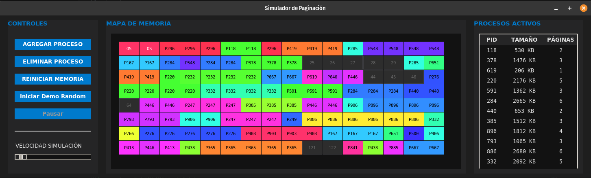

# Simulador de Paginación de Memoria

Este proyecto es una simulación gráfica interactiva diseñada para demostrar los conceptos fundamentales de la gestión de memoria en Sistemas Operativos, específicamente la técnica de **Paginación**. Desarrollado en Python con una interfaz moderna basada en `tkinter`, permite visualizar en tiempo real cómo se asignan, liberan y gestionan los marcos de memoria.



## 🚀 Características Principales

### 1. Interfaz Moderna "Dark Neon"
El simulador cuenta con un diseño visual actualizado al estilo 2025:
- **Modo Oscuro Profundo**: Fondo `#1E1E1E` para reducir la fatiga visual y resaltar los elementos clave.
- **Acentos Neón**: Los procesos se generan con colores de alta saturación y brillo (generación HSV) para que destaquen vibrantes sobre el mapa de memoria oscuro.
- **Tipografía Limpia**: Uso de fuentes como *Segoe UI* y *Consolas* para una legibilidad óptima.

### 2. Simulación de Memoria Masiva
- **Capacidad**: 64 MB (65,536 KB) de memoria física simulada.
- **Marcos (Frames)**: 128 marcos de 512 KB cada uno.
- **Visualización**: Mapa de memoria de 16 columnas que muestra el estado de cada marco (Libre, SO, o ID de Proceso).

### 3. Modo Demo Aleatorio Inteligente
Un sistema de demostración automática para visualizar el comportamiento de la memoria bajo carga:
- **Actividad Continua**: Genera y elimina procesos automáticamente.
- **Lógica Ponderada**: 70% de probabilidad de crear un nuevo proceso vs 30% de eliminar uno existente, lo que mantiene la memoria activa y llena de "vida".
- **Control Total**:
    - **Iniciar/Detener**: Arranca o para la simulación.
    - **Pausar/Continuar**: Permite congelar el estado para inspección manual y reanudar después.
    - **Velocidad Variable**: Un deslizador permite ajustar la velocidad de la simulación desde 0.1x (Muy Rápido) hasta 2.0x (Lento).

### 4. Gestión Manual de Procesos
- **Agregar Proceso**: Permite especificar ID y Tamaño manualmente.
- **Eliminar Proceso**: Un diálogo personalizado lista todos los procesos activos con su color correspondiente para una fácil identificación y eliminación.

---

## 📚 Conceptos Teóricos Implementados

### Paginación (Paging)
La paginación es un esquema de gestión de memoria que elimina la necesidad de asignación contigua de memoria física.
- **Páginas**: El proceso se divide en bloques de tamaño fijo llamados páginas.
- **Marcos (Frames)**: La memoria física se divide en bloques del mismo tamaño llamados marcos.
- **Tabla de Páginas**: El simulador mantiene internamente el mapeo de qué páginas de un proceso están en qué marcos físicos.

### Fragmentación Interna
Es la pérdida de espacio de memoria que ocurre cuando el tamaño de un proceso no es un múltiplo exacto del tamaño de página.
- **Cálculo**: `Tamaño de Página - (Tamaño del Proceso % Tamaño de Página)` (si el residuo no es 0).
- **Visualización**: El simulador calcula y muestra en tiempo real la suma total de KB desperdiciados por fragmentación interna en todos los procesos activos.

### Memoria del Sistema Operativo (SO)
El simulador reserva los primeros marcos de memoria (1024 KB) exclusivamente para el Sistema Operativo, mostrándolos en un color distintivo (Rosa Neón) e impidiendo que los procesos de usuario los ocupen.

---

## 🛠️ Detalles Técnicos de Implementación

### `MemoryManager` (Backend)
La clase `MemoryManager` es el cerebro de la simulación:
- **Estructura de Datos**: Utiliza una lista `frames` donde cada índice representa un marco físico. `None` indica libre, `"OS"` indica reservado, y un entero indica el PID del proceso ocupante.
- **Algoritmo de Asignación**:
    1. Calcula cuántas páginas necesita el proceso (`ceil(tamaño / 512)`).
    2. Busca índices libres en la lista `frames`.
    3. Si hay suficientes, asigna los marcos (no necesariamente contiguos).
    4. Si no hay suficientes, lanza un error de memoria (manejado por la GUI).

### Interfaz Gráfica (Frontend)
Construida con `tkinter` y `ttk` para los widgets modernos:
- **Canvas**: Dibuja la cuadrícula de memoria. Cada celda es un rectángulo cuyo color se actualiza dinámicamente según el estado del marco.
- **Treeview**: Muestra la tabla detallada de procesos (PID, Tamaño, Páginas ocupadas).
- **Loop de Eventos**: El modo Demo utiliza `root.after()` para programar pasos de simulación sin congelar la interfaz, permitiendo interacción (pausa, cambio de velocidad) en tiempo real.

---

## 📖 Manual de Usuario

1.  **Ejecutar el Programa**:
    ```bash
    python3 main.py
    ```
2.  **Iniciar Demo**:
    - Haz clic en **"INICIAR SIMULACIÓN"**.
    - Ajusta la velocidad con el deslizador inferior.
    - Observa cómo se llena la memoria y aparecen huecos cuando se eliminan procesos.
3.  **Interacción Manual**:
    - Pulsa **"PAUSAR"** en cualquier momento.
    - Usa **"AGREGAR PROCESO"** para insertar uno específico.
    - Usa **"ELIMINAR PROCESO"** para liberar espacio (selecciona de la lista coloreada).
    - Pulsa **"CONTINUAR"** para que la simulación siga su curso.
4.  **Reinicio**:
    - El botón **"REINICIAR MEMORIA"** limpia todo (excepto el SO) y deja la memoria lista para empezar de cero.

---

## 📦 Requisitos

- Python 3.x
- Librería `tkinter` (usualmente incluida con Python).
- Módulo `colorsys` (estándar de Python) para la generación de colores neón.

---
*Desarrollado con ❤️ y Python.*
